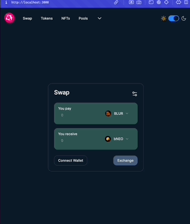

# Switcheo Code Challenge #1

Coding challenge for Switcheo Labs fullstack engineer intern coding challenge

## Problem 2 Setup

```
npm install
```

```
npm run dev
```

## Problem 2 Demo



## Problem 5 Setup

### For blockchain, run the following command in the 'bryanchain' directory:

```
ignite chain serve
```

### For the client side, run the following command in the 'react' directory:

```
npm install
```

```
npm run dev
```

## Problem 5 Demo


